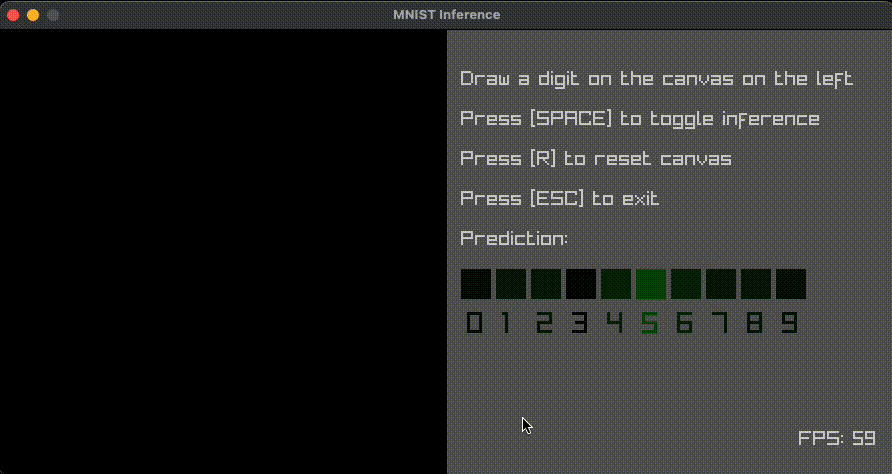

# ONNX Inference In C

Using ONNX runtime to run inference on an ONNX model in C.



## Requirements

- C Compiler
- CMake
- Conda

## Usage

### With Task

For convenience, you can install [Task](https://taskfile.dev/) (e.g. with `brew install go-task`) and run the command `task` in the terminal to see the list of available tasks.

You could either run `task all` which runs every task in correct order or run them manually one by one:

```bash
task conda
task train
task build
task run
```

### Without Task

If you don't want to install Task, you can just run the following commands manually.

Setup python environment, for example, using conda:

```bash
conda create -n onnx-example python=3.10 -y

conda activate onnx-example

python -m pip install -r requirements.txt

python train.py
```

This will train and create a TF saved model in `saved_model` directory.

Next, we convert the model to onnx:

```bash
python -m tf2onnx.convert --saved-model ./saved_model --output ./model.onnx
```

Now the model is available in the ONNX format, we can build and run the app:

```bash
cmake -B ./cmake-build -S . # ONNX Runtime is built in this step
cmake --build ./cmake-build --target onnx_inference_example

./cmake-build/onnx_inference_example
```

Note that `cmake` is installed as a python package when you run `python -m pip install -r requirements.txt`.

## ONNX Runtime

Command for building ONNX Runtime for your platform will have to be explicitly set in the `CMakeLists.txt` for your platform as __I'm building only for macOS arm64__. Check out [how to build ONNX Runtime](https://onnxruntime.ai/docs/build/inferencing.html) for your platform and update the command in `execute_process` accordingly before running `task build` or `cmake -B ./cmake-build -S .`.
