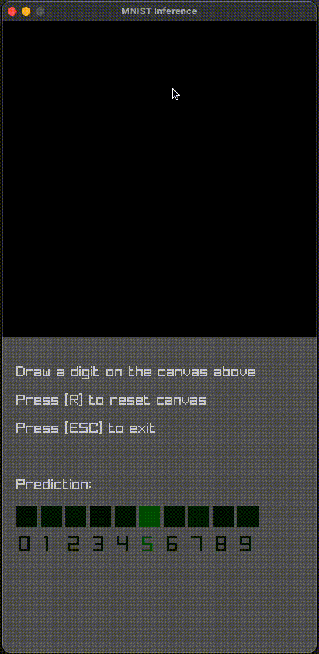

# ONNX Inference In C

Using ONNX runtime to run inference on an ONNX model in C.



## Requirements

- C Compiler
- CMake
- Conda

## Usage

For convenience, you can install [Task](https://taskfile.dev/) (e.g. with `brew install go-task`) and run the command `task` in the terminal to see the list of available tasks.

You could either run `task all` which runs every task in correct order or run them manually one by one:

```bash
task conda
task deps
task train
task build
task run
```
